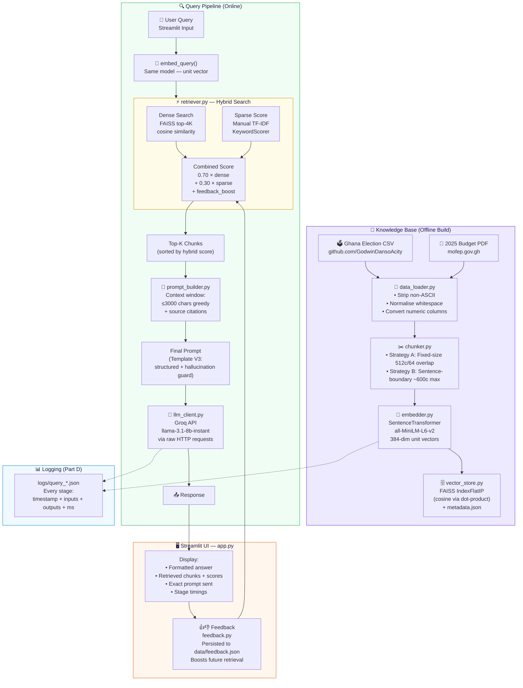

# Architecture Diagram & Justification — Part F

**Student:** Najart Rauf Awuni | **Index:** 10022300177

---

## Mermaid Architecture Diagram

---

## Why This Architecture Suits the Academic City Domain

### 1. Dual-source heterogeneous data
Academic City requires querying both **structured tabular data** (election results: parties, constituencies, vote counts) and **unstructured narrative text** (budget policy paragraphs). A single retrieval strategy fails both. The hybrid search architecture solves this by:
- Dense search capturing semantic intent ("fiscal responsibility" → budget deficit chunks)
- Sparse search capturing precise entity matches ("NDC, Ashanti, 2020" → exact CSV rows)

### 2. No hallucination by design
The `CONTEXT ONLY` instruction in Template V3 and the source-citation requirement mean the model is explicitly told it cannot invent facts. This is critical for a political/financial domain where wrong numbers have real consequences.

### 3. Feedback loop closes the quality gap
The `FeedbackStore` records which chunks students found helpful. This is especially valuable for domain-specific jargon (e.g. "E-Levy", "COCOBOD") where the generic embedding model may not initially rank well.

### 4. Stateless chunking + persistent index
Building the FAISS index once and loading it from disk on subsequent runs means the Streamlit app starts in ~2 seconds after the first build, making it practical for live demonstration.

### 5. Sentence-boundary chunking preserves budget policy context
The 2025 Budget PDF contains multi-sentence policy statements. Splitting at sentence boundaries ensures that "The government targets a primary balance surplus of 0.5% of GDP by 2027" is never split mid-sentence, preserving the complete numerical claim for retrieval.
